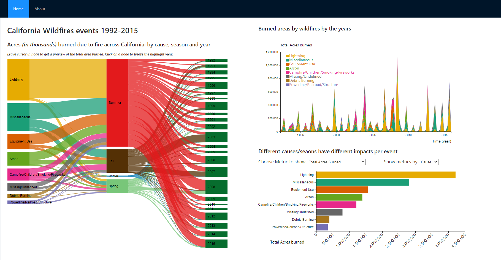

# Instructions

The dashboard was created with an optimal resolution of 1920px x 950px. 

The repository comes with the JSON pre-processed files to create the visualizations. To create them again, for any reason, the user will need to manually download the US Wildfire data sets from https://www.kaggle.com/rtatman/188-million-us-wildfires, and put it in the "Data" directory. The R script "Data-processing/data_processing.R" will generate all JSON files that the dashboard uses as input.  

After setting the required inputs datasets in `/scr/assets/data', the required steps are needed to display the Dashboard. From the command prompt run the following commands:

1. `npm i` (only first time, to install all required libraries)
3. `npm start`

# Expected View of the Dashboard
