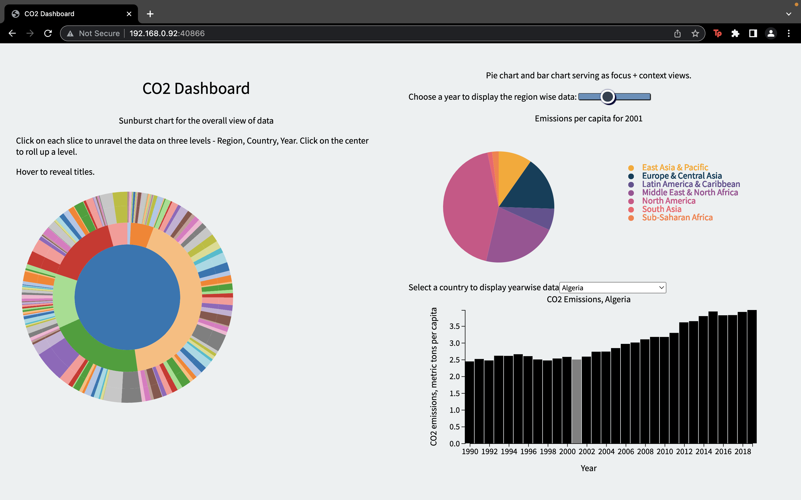

# CO2-Dashboard
In this assignment, I have used the CO2 emission dataset. This dashboard is built with the simple skeleton - a very barebones framework for web development as it is not using any of the modern frameworks.

# Requirements

* This dashboard has three visualization views.
* The visualization includes at least one advanced visualization method - **sunburst chart**.
* The visualizations depict different dimensions or aspects of the dataset to be examined.
* The three visualizations fit on a fullscreen browser.
* Legends for each view is provided as well as labels for axis.
* One of the three views serves as an overview of the data.
* Chosen appropriate visual encodings.
* The design paradigm followed is focus + context.

# Screenshot 



# Setup 

Run This Commands To View The Dashboard Locally : 

Change the current working directory to the location where you want the cloned directory to be made : 
```
cd <your_directory>
```
Clone the repository and install http-server module : 
```
git clone <this_repository>
npm install -g http-server
http-server -p 3000
```
Install the list of packages specified in requirements.txt.

Once you are at the same directory as package.json run the following command. 

```
npm i
```

Now You Can view the dashboard on http://localhost:3000


