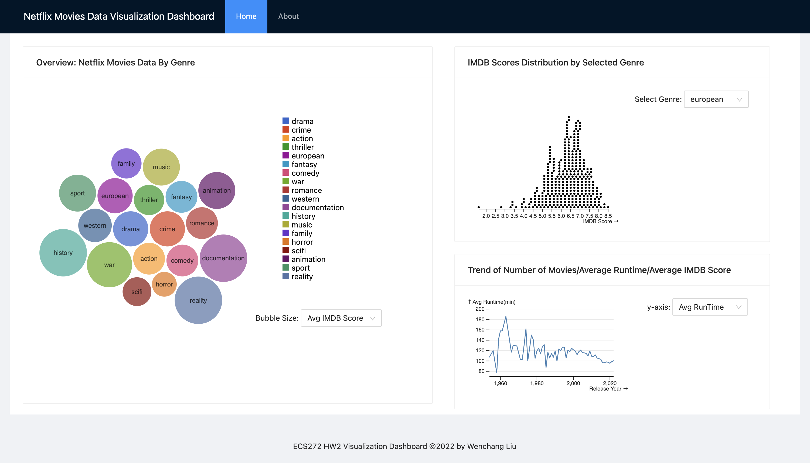

# ECS272 HW2 - Wenchang Liu

## How to run

* `npm install` to install all packages
* `npm start` to start a localhost webapp at [localhost:8080](http://localhost:8080)

## Display Settings

* Chrome, Zoom(100%)
* Developped using the default built-in display setting for mbp14
* If the the charts cannot be placed into the screen, please try to zoom out

## Overview

* 
* The objective of the dashboard is to explore the netflix movies data, the visualizations are allowing users to explore the following:
  * Do people prefer certain genre, i.e. are users give higher IMDB score for certain genre?
    * Explore the IMDB score distribution for each genre
  * Which genre of the movies Netflix prefer to produce?
  * Explore the trends of average IMDB score/average runtime/number of movies year by year
* Bubble Chart(context):
  * intro: each bubble represent a genre, the bubble size is showing a dimension of each genre. We are also giving each genre a different color using the color scheme google20c
  * aim: overview of each genre
  * widget: switch the meaning of bubble size between average IMDB score and number of movies of each genre
  * hover: showing the information of genre: genre name, average IMDB score of that genre, number of movies of that genre
* Beeswarm Chart(advanced visualization, focus):
  * intro: similar to histogram, we can explore distribution, but we are showing every data point in beeswarm
  * aim: the detailed information of the IMDB score for each genre
  * widget: select any of the 19 genre to display
* Line chart:
  * x-axis is the release year, y-axis is the corresponding information of a specific year, together we can see the trend
  * aim: explore the movies trend of average runtime/average IMDB score/number of movies year by year
  * widget: switch y-axis among average runtime/average IMDB score/number of movies
  * hover: detailed release year and correponding y-axis value for specified point
