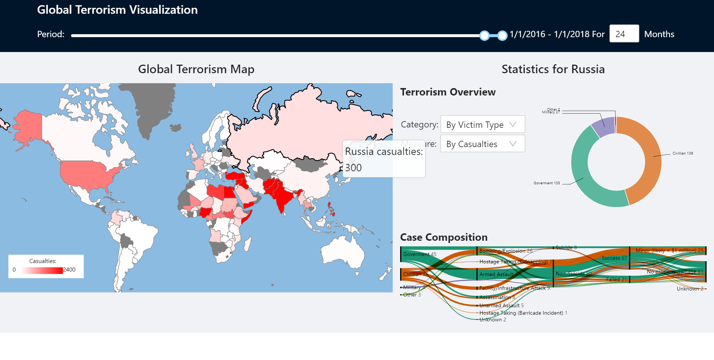

# Instructions

The Global terrorism dataset is too big to push into Github (162MB>=100MB). And only Github Enterprise support Git LFS features.

1. Please download the dataset from https://www.kaggle.com/START-UMD/gtd/download . 
2. Extract the file `globalterrorismdb_0718dist.csv` and copy it to `Homework2/znwu/src/datasets`
3. `cd Homework2/znwu`
4. `npm install`
5. `npm start`
6. Open http://localhost:3000  in browser
7. Wait a few seconds for rendering

# Expected Screenshot
