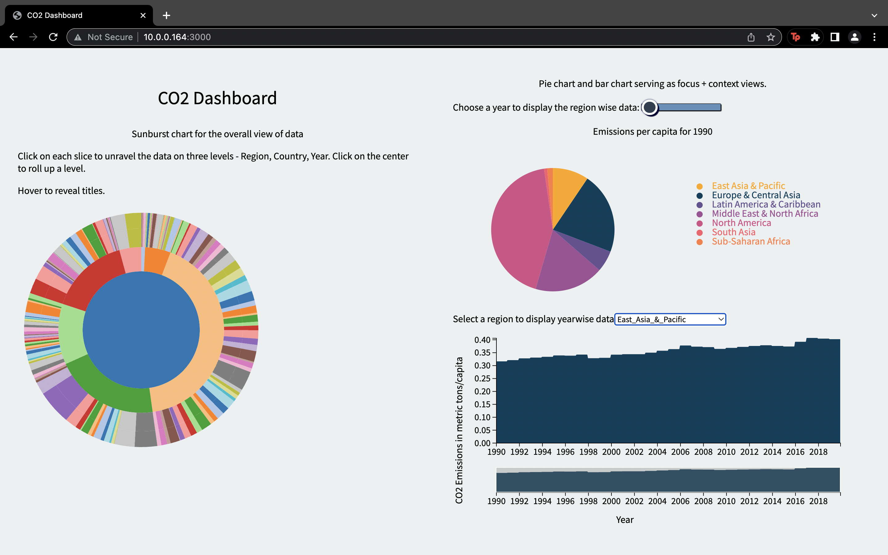

# CO2-Dashboard
In this assignment, I have used the CO2 emission dataset. This dashboard is built with the simple skeleton - a very barebones framework for web development.

## Requirements

* This dashboard has three visualization views - 
    1. **Bar Chart** 
    2. **Pie Chart**
    3. **Sunburst Chart**
* One of your views must represent an overview of the dataset - **The sunburst chart serves as an overview of the data. To simplify the chart and abstract the complexity, I have taken the 30 year average for each country to show the contribution of each country.**
* As with the previous homework, one of your views must be an advanced visualization - **Sunburst Chart.**
* 
1. **Bar Chart - depicts the yearwise distribution for the countries, to choose a country use the dropdown. Tooltips will reveal further information.**
2. **Pie Chart - displays the regionwise average for each year, to choose a year use the slidebar. Tooltips will reveal further information.**
3. **Sunburst Chart - an overall view of the data with each country's 30 year average (1990-2019). Click on each slice to unravel the data on three levels - Region, Country, Year. Click on the center to roll up a level. Hover on each arc to reveal more information.** 
* Implement two of the following interaction techniques into your dashboard.
1. **Brushing: The bar chart is implemented with brush as the transition and zoom as the animation to display the yearwise data from a closer view, even month distribution can be seen.**
2. **Selection, Pan and Zoom: The zoomable sunburst chart incorporates panning and zooming as the animation and selection as the transition.**
* Legends for each view is provided as well as labels for axis.
* Chosen appropriate visual encodings - **The colors for the pie chart have been chosen based on the share of each of the region. The colors for barchart and sunchart were chosen to show the distribution.**
* The design paradigm followed is focus + context.

## Screenshot 



## Setup 

Run These Commands To View The Dashboard Locally: 

Change the working directory to the location where you want to clone the repository: 
```
cd <your_directory>
```
Clone the repository and install http-server module using npm: 
```
git clone <this_repository>
npm install -g http-server
```
Start the server and use the link served to view the dashboard: 
```
http-server -p 3000
```


