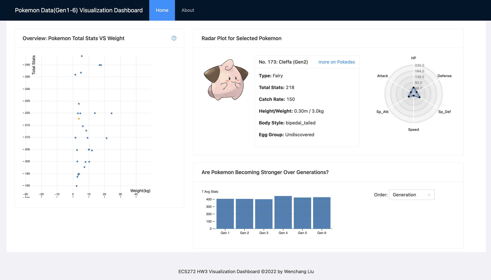

# ECS272 HW2 - Wenchang Liu

## How to run

* `npm install` to install all packages
* `npm start` to start a localhost webapp at [localhost:8080](http://localhost:8080)
* There will be a online version on [Vercel](https://ecs272-hw2-wenchang.vercel.app/)

## Display Settings

* Chrome, Zoom(100%)
* Developped using the default built-in display setting for mbp14
* If the the charts cannot be placed into the screen, please try to zoom out

## Overview

* 
* The objective of the dashboard is to explore the Pokemon data, the visualizations are allowing users to explore the following:
  * Is the weight of the Pokemon related to the total stats?
  * The details of a selected Pokemon
  * Is Pokemon getting strong each generation?
* The interaction and animated transitions are:
  * Select: to select a specific point on the scatter plot, the selected point will become orange
  * Pan and Zoom: the scatter plot support pan and zoom, scroll to zoom, click and hold to pan
  * Sort animated transition: the bar chart support sorting animation according to ascending, descending or generation order
* Scatter Chart(context):
  * Provide an overview of all Pokemon in the dataset and layout according to total stats and weight
  * Users can pan and zoom to explore the data points and select one to see the details
  * Some Pokemon has the exact same total stats and weight, so we add a small random value to x, y coordinates so that they won't overlap
* Radar Chart(advanced visualization, focus):
  * Provide details for the selected Pokemon, the view show the image, basic info, and a radar plot for its stats of HP, atk, def, sp atk, sp def, speedß
  * Hover on the radar plot dot to see the exact value
* Bar chart:
  * We calculated the average total stats for every generation and provide the information in a bar chart
  * Users can select the sorting order in the select widget
